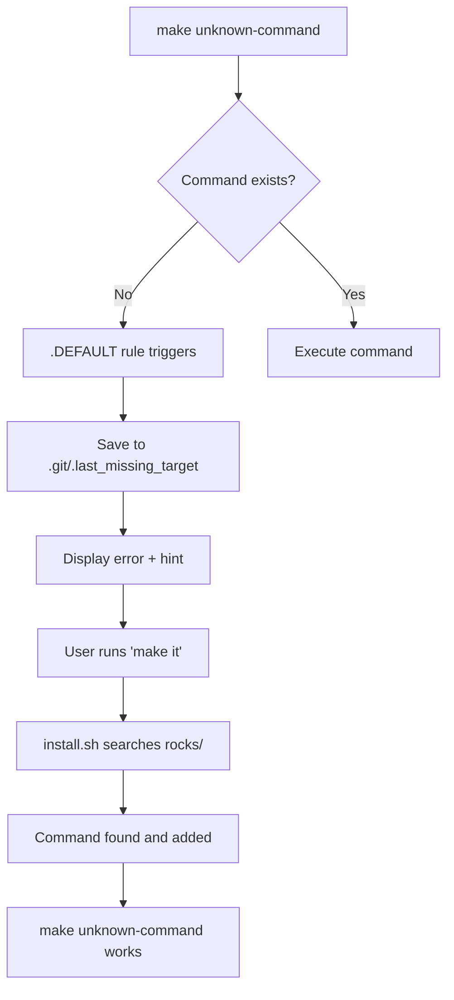

# 🔧 Development Guide: Technical Deep Dive

> *"Understanding the magic behind `make it`"*

This document covers the technical architecture, implementation details, and development workflow for the makefiles system.

## 🏗️ System Architecture

### Core Components

```
makefiles/
├── init.sh                 # Bootstrap script
├── install.sh             # Command discovery script  
├── rocks/                 # Command modules
│   ├── make-engine       # Core system functionality
│   ├── make-git          # Git workflow commands
│   ├── make-rails        # Rails development commands
│   └── make-sitedog      # SiteDog integration
└── README.md             # User-facing documentation
```

### Data Flow



## 🔬 Technical Implementation

### 1. Bootstrap System (`init.sh`)

**Purpose**: One-time setup of the makefiles system

**Key Features**:
- Downloads latest `make-engine` from rocks/
- Creates minimal Makefile with `include make-*.mk`
- Always overwrites make-engine.mk (self-updating)

**Critical Code**:
```bash
# Create/update Makefile
if [[ ! -f "./Makefile" ]]; then
    echo "include make-*.mk" > "Makefile"
elif ! grep -q "include make-\*\.mk" "./Makefile" 2>/dev/null; then
    echo -e "include make-*.mk\n$(cat ./Makefile)" > ./Makefile.tmp
    mv ./Makefile.tmp ./Makefile
fi
```

### 2. Command Discovery (`install.sh`)

**Purpose**: Find and install missing commands from the repository

**Algorithm**:
1. Parse target name from failed command (`make deploy` → `deploy`)
2. Shallow clone repository (`git clone --depth 1`)
3. Search all `rocks/make-*` files for target pattern
4. Extract command block using awk pattern matching
5. Append to local Makefile

**Performance Optimizations**:
- Shallow clone (`--depth 1`) reduces download time
- Temporary directory cleanup
- Early exit on target conflicts

**Search Pattern**:
```bash
escaped_target=$(echo "$target" | sed 's/\./\\./g')
for file in $(find "$TEMP_DIR/rocks" -name "make-*"); do
    if grep -q "^$escaped_target:" "$file"; then
        found_files="$found_files $file"
    fi
done
```

### 3. Core Engine (`rocks/make-engine`)

**Purpose**: Provides essential system functionality

**Key Variables** (auto-detected):
```makefile
GIT_REPO = $(shell git remote get-url origin | sed -E 's/.*[\/:]([^\/]+\/[^\/]+)\.git$$/\1/')
GITHUB_USER = $(shell gh api user --jq '.login' 2>/dev/null || echo "inem")
REGISTRY = $(shell echo "$(GIT_URL)" | grep -q "github.com" && echo "ghcr.io/$(GIT_REPO)")
```

**Core Commands**:
- `it`: Find and install last failed command
- `it!`: Find, install, and execute immediately  
- `rock`: Download specific command modules
- `info`: Display all detected variables

### 4. Smart Module System (`make rock`)

**Purpose**: Modular command installation with intelligent merging

**Dynamic Rule Generation**:
```makefile
$(if $(filter rock,$(MAKECMDGOALS)),$(eval $(foreach arg,$(filter-out rock,$(MAKECMDGOALS)),$(arg): ; @:)))
```

**How it works**:
1. Only activates when `rock` is in MAKECMDGOALS
2. Creates empty rules for all arguments (`git: ; @:`)
3. Prevents "target not found" errors for arguments
4. Preserves `.DEFAULT` behavior for other commands

**Intelligent Merging Algorithm**:
```bash
existing_commands=$(grep "^[a-zA-Z][^:]*:" "$target_file" | cut -d: -f1 | sort)
new_commands=$(grep "^[a-zA-Z][^:]*:" "$temp_file" | cut -d: -f1 | sort)

for cmd in $new_commands; do
    if ! echo "$existing_commands" | grep -q "^$cmd$"; then
        # Add only new commands
        awk "/^$cmd:/{flag=1; print} flag && /^[^[:space:]]/ && !/^$cmd:/{flag=0} flag && !/^$cmd:/{print}" "$temp_file" >> "$target_file"
    fi
done
```

### 5. Error Handling & Validation

**HTTP 404 Detection**:
```bash
if curl -sSL "$url" -o "$temp_file" && [ -s "$temp_file" ] && ! grep -q "404: Not Found" "$temp_file"; then
    # Success: file exists and is not 404 page
else
    echo "❌ Failed to download make-$module_name (not found in rocks/)"
    exit 1
fi
```

**Edge Cases Handled**:
- Empty files (`[ -s "$temp_file" ]`)
- HTML 404 pages (`! grep -q "404: Not Found"`)
- Network failures (curl exit codes)
- Malformed command blocks

## 🎭 Advanced Patterns

### 1. Variable Resolution Order

1. **Local Makefile** (highest priority)
2. **Environment variables** 
3. **Auto-detected values** (git, gh CLI, etc.)
4. **Fallback defaults**

```makefile
# Example: GITHUB_USER detection
GITHUB_USER = $(shell \
    if command -v gh >/dev/null 2>&1 && gh auth status >/dev/null 2>&1; then \
        gh api user --jq '.login' 2>/dev/null; \
    elif git config --get user.email >/dev/null 2>&1; then \
        curl -s "https://api.github.com/search/users?q=$$(git config --get user.email)+in:email" | grep '"login"' | head -1 | cut -d'"' -f4; \
    else \
        echo "inem"; \
    fi)
```

### 2. Cross-Platform Compatibility

**URL Processing** (handles different git remote formats):
```bash
# SSH: git@github.com:user/repo.git
# HTTPS: https://github.com/user/repo.git  
# Both resolve to: user/repo
GIT_REPO = $(shell git remote get-url origin | sed -E 's/.*[\/:]([^\/]+\/[^\/]+)\.git$$/\1/' | sed 's/\.git$$//')
```

**Shell Detection**:
```bash
# Bash-specific features wrapped in compatibility checks
if [[ -n "$1" ]]; then  # Bash array syntax
    # bash-specific code
else
    # POSIX fallback
fi
```

### 3. Performance Considerations

**Lazy Evaluation**:
```makefile
# Variables are only computed when accessed
EXPENSIVE_COMPUTATION = $(shell complex-command-here)

# Used in target, only runs when target executes
target:
    @echo $(EXPENSIVE_COMPUTATION)
```

**Caching Strategy**:
- Git operations cached in shell variables
- HTTP requests minimized (shallow clone)
- File operations use temporary files to avoid partial states

## 🧪 Testing Strategy

### Unit Tests (Concept)
```bash
# Test command discovery
test_command_discovery() {
    echo "deploy: echo 'deploying'" > test-make-file
    result=$(search_command "deploy" test-make-file)
    assert_contains "$result" "deploy:"
}

# Test variable resolution  
test_github_user_detection() {
    export GH_TOKEN="fake-token"
    user=$(detect_github_user)
    assert_not_empty "$user"
}
```

### Integration Tests
```bash
# End-to-end workflow test
test_full_workflow() {
    # Setup clean environment
    rm -f Makefile make-*.mk
    
    # Initialize system
    bash init.sh
    
    # Test command discovery
    make nonexistent-command || true
    make it
    
    # Verify command was added
    assert_file_contains "Makefile" "nonexistent-command:"
}
```

### Manual Testing Checklist
- [ ] `make it` with various failed commands
- [ ] `make rock` with existing and non-existent modules
- [ ] Variable detection across different git configurations
- [ ] Error handling (network failures, malformed files)
- [ ] Cross-platform compatibility (macOS, Linux)

## 🐛 Debugging Guide

### Common Issues

**1. Command Not Found After `make it`**
```bash
# Debug steps:
grep "target-name:" Makefile  # Was command actually added?
make -n target-name          # Dry run to see what would execute
cat .git/.last_missing_target # Check what command was recorded
```

**2. Module Download Failures**
```bash
# Check network connectivity
curl -I https://instll.sh/inem/rocks/rocks/make-git

# Verify module exists
ls -la rocks/make-*

# Check for 404 content
cat make-module.mk | head -5  # Should not contain HTML
```

**3. Variable Detection Issues**
```bash
# Debug variable resolution
make info                    # Show all detected variables
git remote get-url origin    # Check git configuration
gh auth status              # Verify GitHub CLI authentication
```

### Logging & Diagnostics

**Enable Verbose Mode**:
```bash
# Set in local Makefile for debugging
SHELL = /bin/bash -x  # Enable bash tracing
```

**Debug Variable Resolution**:
```makefile
debug-vars:
    @echo "GIT_REPO: $(GIT_REPO)"
    @echo "GITHUB_USER: $(GITHUB_USER)"  
    @echo "REGISTRY: $(REGISTRY)"
    @echo "Working Directory: $(PWD)"
```

## 🚀 Contributing Guidelines

### Code Style

**Shell Script Conventions**:
```bash
# Use double quotes for variables
echo "Processing: $variable"

# Check exit codes explicitly  
if curl -sSL "$url" -o "$file"; then
    echo "Success"
else
    echo "Failed" >&2
    exit 1
fi

# Use descriptive variable names
module_name="$1"
target_file="make-$module_name.mk"
temp_file="/tmp/make-$module_name-$$.mk"
```

**Makefile Conventions**:
```makefile
# Use tabs for indentation (required by Make)
target:
	@echo "Command with @ prefix for quiet execution"
	echo "Command without @ shows the command"

# Use consistent variable naming
UPPER_CASE = for constants
lower_case = for computed values
```

### Adding New Commands

**1. Choose the Right Module**:
- `make-git`: Git workflows, branch management
- `make-rails`: Rails-specific development tasks  
- `make-docker`: Container operations
- Create new module for distinct domains

**2. Command Design Principles**:
```makefile
# Good: Clear, memorable, composable
deploy:
    docker build -t $(REGISTRY):$(IMAGE_TAG) .
    docker push $(REGISTRY):$(IMAGE_TAG)

# Bad: Too specific, hard to remember
deploy-to-production-with-rollback-and-notifications:
    # complex implementation
```

**3. Documentation in Code**:
```makefile
# Include brief comments for complex commands
build-and-push: # Build Docker image and push to registry
    @echo "Building $(IMAGE_NAME):$(IMAGE_TAG)"
    docker build -t $(REGISTRY):$(IMAGE_TAG) .
    docker push $(REGISTRY):$(IMAGE_TAG)
```

### Release Process

**1. Local Testing**:
```bash
# Test in clean environment
cd /tmp && mkdir test-project && cd test-project
curl -sSL instll.sh/inem/rocks/init.sh | bash
make rock git  # Test module download
make it        # Test command discovery
```

**2. Update Version References**:
```bash
# Update any hardcoded URLs or version references
grep -r "makefiles" . --include="*.sh" --include="*.mk"
```

**3. Documentation**:
- Update README.md for user-facing changes
- Update DEVELOPMENT.md for technical changes
- Add to CHANGELOG.md

## 🔮 Future Technical Improvements

### 1. Performance Enhancements
- **Command caching**: Cache command search results locally
- **Parallel downloads**: Download multiple modules simultaneously  
- **Delta updates**: Only sync changed commands

### 2. Advanced Features
- **Version pinning**: `make rock git@v1.2.0`
- **Dependency management**: Automatic installation of required modules
- **Command aliasing**: `make d` → `make deploy`

### 3. Developer Experience  
- **Better error messages**: Suggest similar commands on typos
- **Command completion**: Bash/zsh autocompletion for available commands
- **Interactive mode**: `make it` with command selection menu

### 4. Architecture Evolution
- **Plugin system**: Third-party module repositories
- **Configuration files**: `.makefiles.yml` for project-specific settings
- **Template system**: Parameterized command templates

---

**"The goal is invisible infrastructure. The system should feel like magic, but the implementation should be crystal clear."**

*Happy hacking! 🛠️*